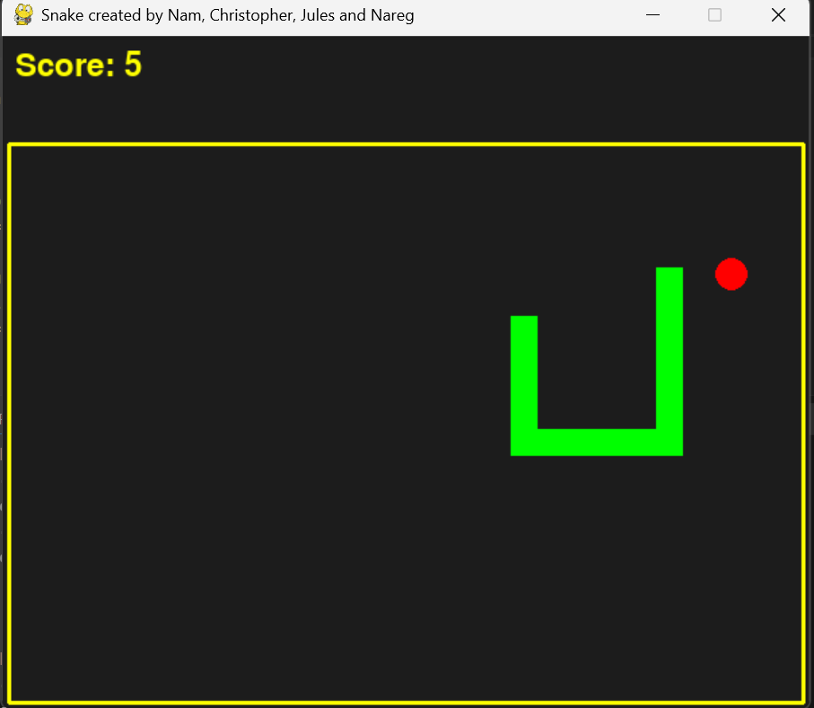
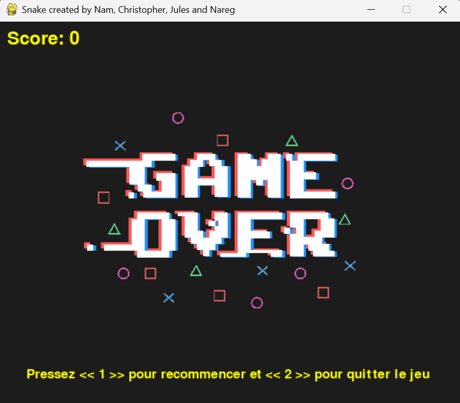

# Snake Game with Pygame

A classic Snake game built in Python using Pygame.  
The snake accelerates as you score points — how long can you survive?

## Features

- Classic Snake mechanics 
- Increasing speed as the score rises 
- Game-over detection with restart option
- Score display
- Clean and simple GUI using Pygame

## Here are some screenshots of the game in action:

  
  

